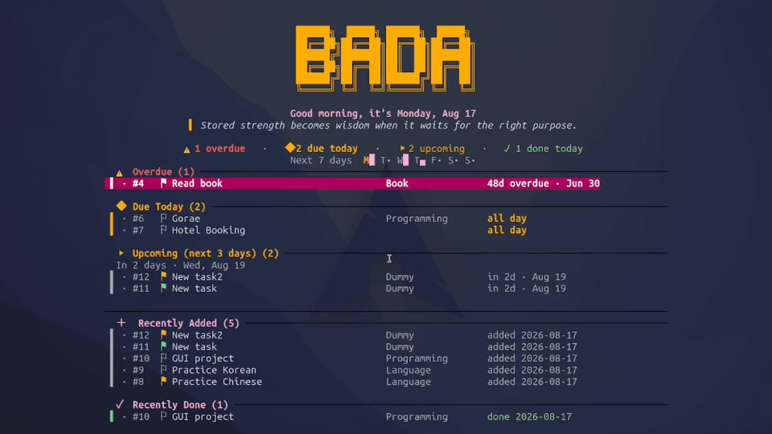

# Bada (바다, “sea”)

<p align="center">
  
</p>

<p align="center">
  A calm, Vim-first terminal task manager for capturing what matters and getting it done.
</p>

Bada keeps your tasks local while giving you the planning tools of a larger
project manager—without leaving the terminal.

## Demo

<p align="center">
  
</p>

## Highlights

- **Fast keyboard workflow** — capture, edit, search, filter, sort, and complete
  tasks without reaching for the mouse.
- **Plan from multiple angles** — agenda, calendar, Gantt timeline, statistics,
  and a daily overview with streaks and upcoming work.
- **Projects that fit your process** — custom status pipelines, Kanban boards,
  project metadata, and optional read-only Git history.
- **Rich task details** — priorities, due and start dates, recurrence, tags,
  assignees, timezones, and multi-line notes.
- **Local-first storage** — tasks live in a local SQLite database, with deleted
  items recoverable from Trash.
- **Personal by design** — configurable keys and seven built-in themes, with
  full color customization.

## See Your Work Your Way

Bada includes focused views for planning at different scales:

- **Agenda** (`:agenda`) — start the day with overdue work, today's schedule,
  upcoming and recurring tasks, recently completed items, and a seven-day
  activity snapshot.
- **Calendar** (`:calendar`) — browse a monthly grid, move by day, week, or month,
  and open any date for a focused task list.
- **Gantt** (`:gantt`) — see task start and due dates on a timeline, with a clear
  marker for today.
- **Statistics** (`:stats`) — review completion counts and streaks, a seven-day
  chart, and pending work grouped by priority and topic.
- **Projects and Kanban** (`:projects`, `:kanban`) — organize related tasks,
  design custom status workflows, and move work through visual stage columns.
- **Search and filters** — find tasks with text or fuzzy search, then narrow the
  list to overdue, pending, completed, today, this week, or a workflow stage.

Each view keeps Bada's keyboard-first controls, so reviewing plans and updating
work remain quick and consistent.

## Quick Start

Bada supports Linux and macOS and requires Go 1.25.5 or newer.

```bash
git clone https://github.com/Han8931/bada.git
cd bada
./install.sh
bada
```

Or run directly from a source checkout:

```bash
go build -o bin/bada ./cmd/todo
./bin/bada
```

## Your First Minute

- `a` — add a task
- `j` / `k` — move through tasks
- `r` — advance task status
- `e` — edit task details
- `Enter` — open task details and notes
- `/` — search
- `:` — open commands such as `:agenda`, `:calendar`, and `:projects`
- `?` — open the complete in-app keybinding reference
- `q` — go back or quit

## Documentation

Read the **[User Guide](GUIDE.md)** for the complete walkthrough, including:

- [views and daily workflows](GUIDE.md#daily-use)
- [task creation and editing](GUIDE.md#create--edit-task-dialog)
- [projects, custom workflows, and Kanban](GUIDE.md#projects--custom-workflows)
- [recurring tasks](GUIDE.md#recurrence-syntax)
- [themes and configuration](GUIDE.md#theme)
- [data locations and Trash](GUIDE.md#data-locations)
- [installation and removal](GUIDE.md#install-linux)

The full configuration reference is available in
[`config.example.toml`](config.example.toml).

## Development

```bash
go test ./...
```

Implementation plans and product ideas are tracked in [TODO.md](TODO.md).
